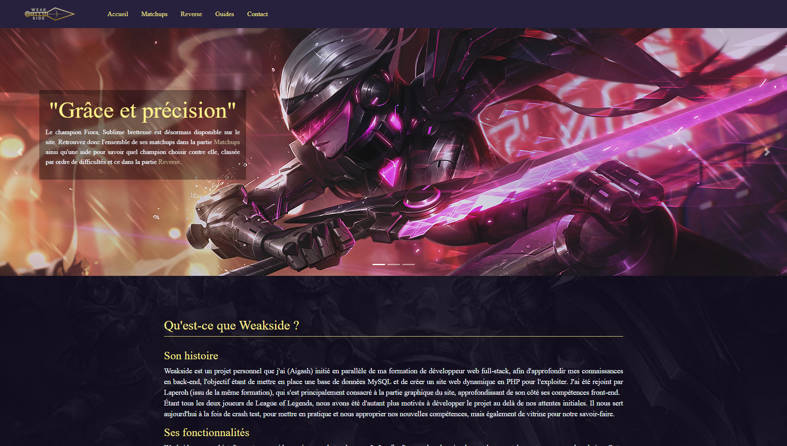
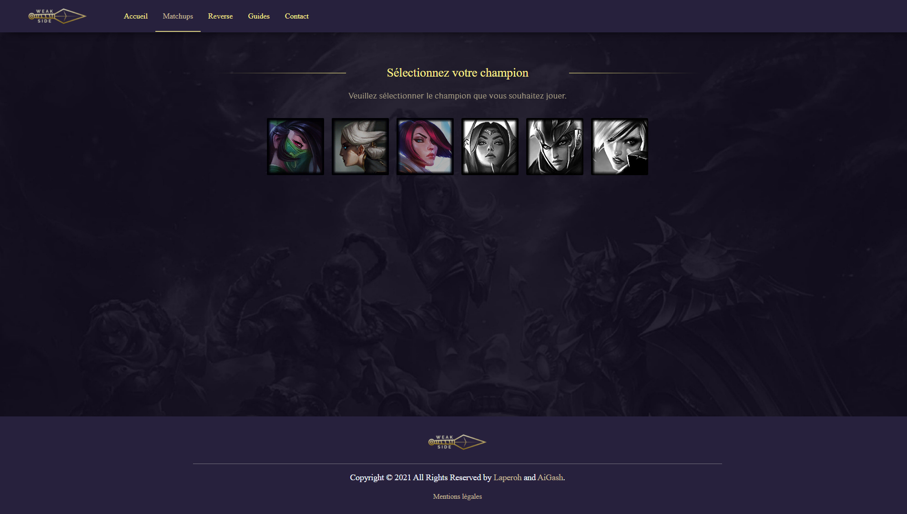
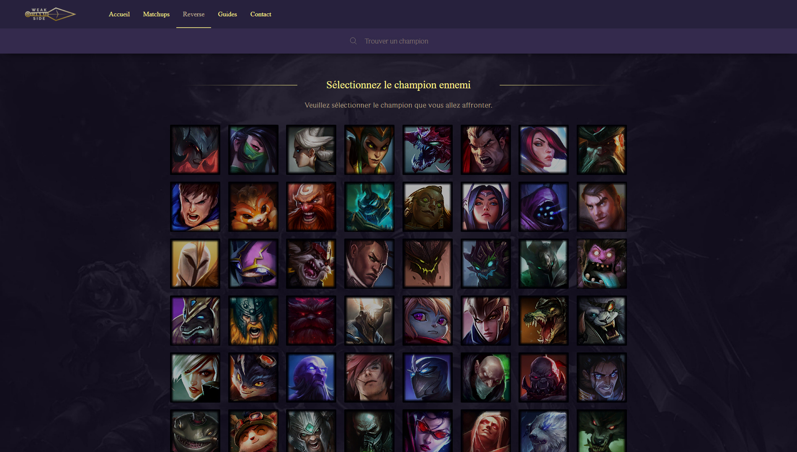
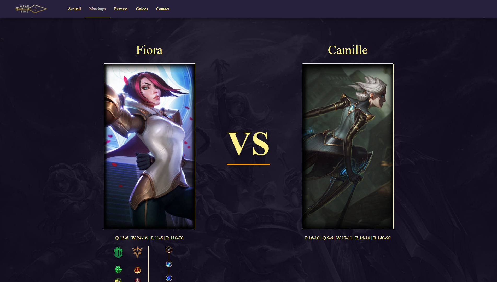
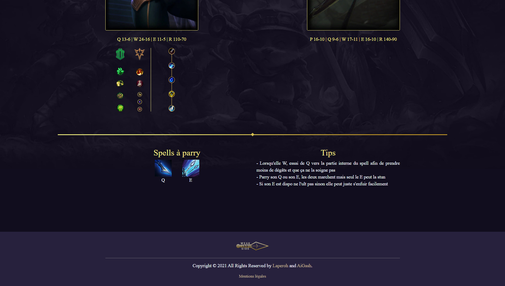
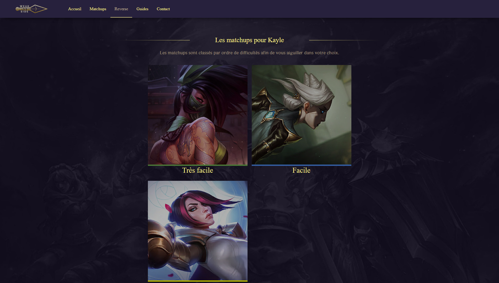
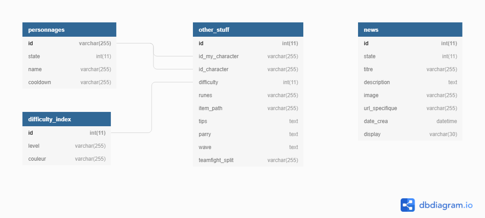

# Weakside

## Description

Weakside est un projet personnel initié par Aigash (https://github.com/aigash) en parallèle de la formation de développeur web full-stack, afin d'approfondir nos connaissances en back et front, l'objectif étant de mettre en place une base de données MySQL et de créer un site web dynamique en PHP pour l'exploiter. J'ai rejoint le projet pour principalement me consacré à la partie graphique du site et approfondissant mes compétences front-end.
Étant tous les deux joueurs de League of Legends, nous avons été d'autant plus motivés à développer le projet au delà de nos attentes initiales. Il nous sert aujourd'hui à la fois de crash test, pour mettre en pratique et nous approprier nos nouvelles compétences, mais également de vitrine pour notre savoir-faire.

## fonctionnalités

Weakside a pour objet d'apporter une aide aux joueurs de top lane sur LoL, afin d'apprendre plus simplement leurs matchups et progresser dans le jeu. Cette aide (Matchups) consiste en un ensemble d'informations concernant le stuff, les runes, un rappel des cooldowns et divers conseils personnalisés selon le choix du champion joué et celui affronté. Weakside propose également une fonctionnalité (Reverse) permettant de classer les matchups par difficulté en sélectionnant le champion affronté, afin d'orienter le joueur dans le choix de son personnage. Enfin, les joueurs pourront trouver divers Guides sur certains champions ainsi que sur la top lane en général.

- Site live hébergé sur OVH : https://weakside.fr/

## Database

The structure is really simple:

